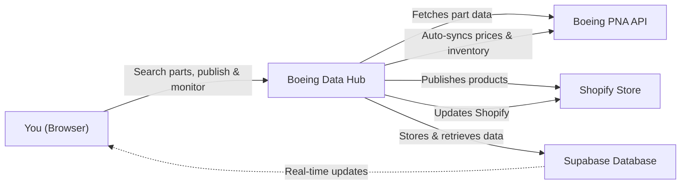
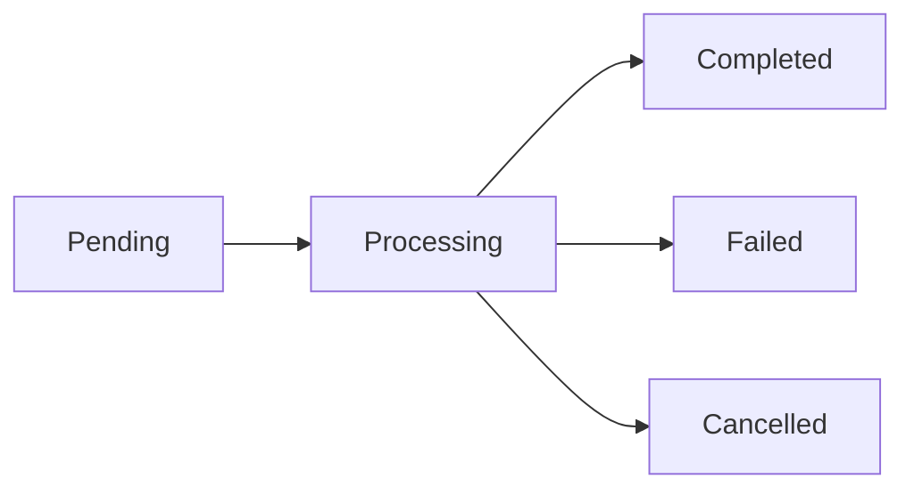
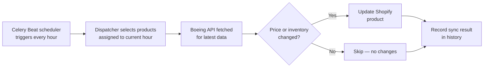

# Boeing Data Hub — User Manual v1

---

## 1. Introduction

Boeing Data Hub is a product data management dashboard for Boeing aviation parts. It helps you search Boeing's parts catalog, review pricing and availability data, publish products to your Shopify retail store, and automatically keep prices and inventory in sync — all from one place.

**Who this manual is for:** Operations staff, procurement specialists, and store administrators who manage Boeing parts in Shopify.

**What you can do with Boeing Data Hub:**
- Search Boeing's Part Number Availability (PNA) system for parts data
- View extracted product details — pricing, inventory, dimensions, compliance codes
- Publish individual or bulk products directly to your Shopify storefront
- Monitor real-time extraction and publishing progress with live status updates
- Browse and search all published products with direct links to Shopify admin
- Monitor automatic price and inventory synchronization with Boeing
- View sync history, hourly distribution, and failure details
- Reactivate failed products or trigger immediate syncs
- Edit product details before publishing

---

## 2. Getting Started

### 2.1 Logging In

1. Open your web browser (Chrome, Firefox, or Edge recommended).
2. Navigate to the **Aviation Gateway** at: `https://hangar.skynetparts.com/`
3. You will see the **Welcome Back** login screen.
4. Enter your **Email** address.
5. Enter your **Password**.
6. Click the **Sign In** button.

`[Screenshot: Aviation Gateway Login Page]`

You should now see the Aviation Gateway dashboard with a greeting message and a list of available portal cards.

*Tip: Bookmark `https://hangar.skynetparts.com/` for quick access.*

*If you cannot log in, contact your system administrator to verify your account.*

### 2.2 Navigating to Boeing Data Hub

After logging in to the Aviation Gateway, you will see the dashboard with your available tools listed as cards.

1. Look for the card labeled **Boeing Data Hub**.
2. Click on the **Boeing Data Hub** card.
3. You will be redirected to the Boeing Data Hub dashboard.

`[Screenshot: Aviation Gateway Dashboard with Boeing Data Hub card highlighted]`

You should now see the Boeing Data Hub dashboard with the **Fetch & Process** tab active and the part number search input visible.

*Note: If you do not see the Boeing Data Hub card, contact your system administrator — you may not have access to this portal.*

---

## 3. Dashboard Overview

After navigating to Boeing Data Hub, you will see the main dashboard with a header bar and three tabs for different workflows.

`[Screenshot: Main Dashboard]`

### 3.1 How the System Works

Boeing Data Hub connects to Boeing's Part Number Availability (PNA) API to fetch product data, normalizes it into a retail-friendly format, publishes products to your Shopify storefront, and automatically syncs prices and inventory on an hourly schedule. Real-time status updates are pushed to your browser via database subscriptions — no need to refresh the page.

### 3.2 Top Navigation Bar

- **Logo & Title** — Displays the application name: "Boeing Product Normalization & Publishing Dashboard" with the subtitle "Ingest, normalize, and publish to Shopify"
- **Home** button (house icon) — Returns to the Aviation Gateway dashboard
- **Logout** button (door icon) — Signs you out of the system

### 3.3 Tab Navigation

Three tabs are displayed below the header bar:

| Tab | Icon | Purpose |
|-----|------|---------|
| **Fetch & Process** | Cloud download icon | Search for Boeing parts, view results, and publish to Shopify |
| **Published Products** | Shopping bag icon | Browse all products currently live on your Shopify store (shows total count badge) |
| **Auto-Sync** | Refresh icon | Monitor automatic price and inventory synchronization |

Click on any tab to switch between views. The currently active tab is highlighted with a blue underline.

### 3.4 Fetch & Process Tab

This is the primary workspace. It contains:

- **Fetch Parts section** (top) — Input area for entering part numbers with a **Fetch** button
- **Recent Requests section** (below) — A list of all batch operations with real-time status, progress bars, and expandable product details
- **Status filter tabs** — Filter batches by: All, Active, Completed, Failed, Cancelled

### 3.5 Published Products Tab

- Displays all products published to Shopify in a table
- Shows: Part Number, Title, Vendor, Price, Inventory, Shopify link, Updated date
- Search bar to filter by part number
- Expandable rows showing full product details (cost, dimensions, weight, description, image)
- **Load More** button for pagination

### 3.6 Auto-Sync Tab

A monitoring dashboard with:

- **Status cards** — Total Products, Active, Success Rate, Current Hour, Syncing Now, Failures
- **Sub-tabs** — Overview, Sync History, Failures
- **Overview** includes an hourly distribution chart, recent activity preview, sync issues preview, and sync configuration info
- **Auto-refresh toggle** (play/pause button) that refreshes data every 30 seconds

---

## 4. Core Features

### 4.1 Searching for Boeing Parts

The Fetch & Process tab is where you search Boeing's PNA system for part numbers. The system fetches data from Boeing, normalizes it, and stages it for review.

1. Click the **Fetch & Process** tab (if not already active).
2. Click in the **part number input field** at the top. It reads: "Enter part numbers (comma, semicolon, or space separated)".
3. Type one or more part numbers. You can separate them with commas, semicolons, spaces, or new lines.
4. As you type, a counter appears on the right side of the input showing how many part numbers you have entered (e.g., "3 parts").
5. Click the **Fetch** button (or press **Enter**).
6. The input clears and a new batch appears in the **Recent Requests** list below with status **pending**.

`[Screenshot: Fetch Parts — Entering Part Numbers]`

You should see the new batch appear in the Recent Requests list. Its status will change from **pending** to **processing** as the system begins fetching data from Boeing.

*Tip: You can enter up to 50,000 part numbers in a single search. The system automatically splits them into batches of 10 for processing against Boeing's API.*

*Note: Boeing's API has a rate limit of 2 requests per minute. Large searches will take time to process — this is expected.*

### 4.2 Understanding Batch Status

Each batch in the Recent Requests list shows a status badge and a progress indicator. Here is what each status means:

| Status | Icon | Color | Meaning |
|--------|------|-------|---------|
| **Pending** | Clock | Gray | Batch is queued and waiting to start |
| **Processing** | Spinning loader | Blue | Batch is actively fetching and processing data |
| **Completed** | Green checkmark | Green | All items processed successfully |
| **Failed** | Red alert | Red | One or more items encountered errors |
| **Cancelled** | X circle | Gray | Batch was manually cancelled |

Each batch also displays:

- **Batch type label** — Shows the current pipeline stage: Extraction, Normalization, or Publishing
- **Progress bar** — Visual indicator of completion percentage
- **Counters** — Extracted / Normalized / Published / Failed counts
- **Timestamp** — When the batch was created

### 4.3 Viewing Extracted Products

When a batch is processing or completed, you can expand it to see the individual products.

1. Find a batch in the **Recent Requests** list.
2. Click the **expand arrow** (chevron) on the right side of the batch row.
3. The batch expands to show a list of **part number tags** with color-coded status indicators, and a **product table** below.
4. Each part number tag shows the extraction status of that specific part:
   - **Blue** — Extracted (data fetched from Boeing)
   - **Amber/Yellow** — Normalized (data processed, ready to publish)
   - **Green** — Published (live on Shopify)
   - **Red** — Failed (error during processing)
   - **Orange** — Blocked (skipped, e.g., no inventory or price)
5. The product table shows detailed information for each extracted part.

`[Screenshot: Expanded Batch with Part Number Tags and Product Table]`

You should see color-coded part number tags and a table of products with columns for Part Number, Title, Dimensions, Weight, Price, Inventory, Status, and Actions.

*Tip: Part number tags and the product table update in real time as extraction progresses — you do not need to refresh the page.*

### 4.4 Reviewing Product Details

The product table provides a detailed view of each extracted part. You can expand individual rows to see even more details.

1. In the product table, find the product you want to review.
2. Each row shows: **Part Number** (monospace), **Title**, **Dimensions** (L × W × H), **Weight**, **Price** (USD), **Inventory** count, and **Status** badge.
3. Click the **expand arrow** on the left of any row to see additional details:
   - Supplier, Vendor, SKU
   - List Price, Net Price, Currency
   - Inventory Status, Base UOM
   - Country of Origin
   - FAA Approval Code, ECCN, Hazmat Code, Schedule B
   - Description
   - Location Availability (warehouse locations and quantities)

`[Screenshot: Expanded Product Row with Full Details]`

You should see a grid of additional product attributes below the row.

### 4.5 Viewing Raw Boeing Data

You can inspect the raw JSON response from Boeing's API for any product. This is useful for troubleshooting or verifying data.

1. In the product table, find the product you want to inspect.
2. Click the **JSON icon** (file with braces) button in the Actions column.
3. A modal dialog opens showing the raw Boeing API response as formatted JSON.
4. Review the data and click outside the modal or press Escape to close it.

`[Screenshot: Raw Boeing Data Modal]`

You should see a dialog with the full JSON payload from Boeing's PNA API for that part number.

### 4.6 Publishing Products to Shopify

Once products are extracted and normalized, you can publish them to your Shopify store.

**Publishing a single product:**

1. In the product table, find a product with status **Normalized** (amber badge).
2. Click the **Publish** button (upload icon) in the Actions column for that product.
3. A spinner appears on the button while publishing is in progress.
4. On success, the product status changes to **Published** (green badge) and a Shopify product ID is assigned.

`[Screenshot: Single Product Publish — Before and After]`

You should see the status badge change from amber "Normalized" to green "Published".

**Publishing all products in a batch (Bulk Publish):**

1. Expand a batch that has completed extraction.
2. Click the **Publish All** button at the top of the product table area.
3. The system automatically filters out products that are already published, blocked, or missing inventory/price data.
4. A new publish batch is created and products are published one at a time (respecting Shopify's rate limit of 30/minute).
5. Progress updates appear in real time — watch the part number tags turn green as each product is published.

`[Screenshot: Bulk Publish Progress]`

You should see a progress indicator and products transitioning from amber to green as publishing completes.

*Note: Only products with inventory > 0 AND price > 0 are eligible for publishing. Products without these values are automatically skipped.*

*Tip: If a product is already published to Shopify (duplicate SKU), it will be skipped to prevent duplicates.*

### 4.7 Editing a Product Before Publishing

You can modify product details before publishing to Shopify. This is useful for correcting titles, adjusting prices, or updating descriptions.

1. In the product table, click the **Edit** button (pencil icon) in the Actions column.
2. The **Edit Product** modal opens, showing the part number in the header.
3. Edit the available fields:
   - **Product Title** — The name displayed on Shopify
   - **Description** — Product description (supports multiline text)
   - **Price** — Selling price in USD
   - Additional fields as available
4. Click **Save** to apply your changes.
5. The modal closes and the product table updates with your changes.

`[Screenshot: Edit Product Modal]`

You should see the modal close and the product row reflect your updated values.

*Note: Edits are saved to the staging database. If the product has already been published, changes will be pushed to Shopify.*

### 4.8 Cancelling a Batch

You can cancel a batch that is still processing. Items already processed are not rolled back — only pending items are skipped.

1. Find the batch in the **Recent Requests** list.
2. Click the **Cancel** button (X icon) on the batch row.
3. The batch status changes to **Cancelled**.
4. Any items that were already extracted, normalized, or published remain in their current state.

You should see the batch status badge change to "Cancelled" (gray).

*Warning: Cancelling a batch cannot be undone. If you need the remaining items, start a new search with those part numbers.*

### 4.9 Filtering Batches

The Recent Requests section includes filter tabs to help you find specific batches.

1. Look at the filter tabs above the batch list: **All**, **Active**, **Completed**, **Failed**, **Cancelled**.
2. Click a filter tab to show only batches with that status.
3. The **Active** filter shows batches that are currently **pending** or **processing**.
4. Click **All** to return to the full list.

You should see the batch list update to show only batches matching the selected filter.

### 4.10 Toggling the Product Table Visibility

When a batch is expanded, you can hide the product table while keeping the part number tags visible. This is useful when you want to see the high-level status tags without scrolling through the full table.

1. Expand a batch by clicking the expand arrow.
2. Click the **Hide/Show Table** toggle button above the product table.
3. The product table hides, but part number tags remain visible and continue to update in real time.
4. Click the toggle again to show the table.

---

## 5. Published Products

### 5.1 Browsing Published Products

The Published Products tab shows all products currently live on your Shopify store.

1. Click the **Published Products** tab.
2. You will see a header showing "Published Products" with the total count (e.g., "View all products published to Shopify (248 total)").
3. Products are displayed in a table with columns:

| Column | Description |
|--------|-------------|
| **Part Number** | SKU in monospace font |
| **Title** | Product name (truncated if long) |
| **Vendor** | Supplier/vendor name |
| **Price** | Formatted USD price |
| **Inventory** | Current stock quantity (green if > 0) |
| **Shopify** | "View" link that opens the product in Shopify admin |
| **Updated** | Date and time of last update |

`[Screenshot: Published Products Table]`

You should see a table of all your published products.

### 5.2 Searching Published Products

1. Click on the **search bar** at the top of the Published Products panel.
2. Type a **part number** to search.
3. The list filters as you type — results update in real time.
4. To clear the search, delete the text in the search bar. The full list will reappear.

You should see the product list update in real time as you type your search term.

### 5.3 Viewing Product Details

1. Find a product in the table.
2. Click the **expand arrow** (chevron) on the right side of the row.
3. The row expands to show additional details:
   - **Cost per Item** — The cost used for profit calculations
   - **Dimensions** — Length × Width × Height with unit of measure
   - **Weight** — Weight with unit
   - **Country of Origin**
   - **Description** — Full product description
   - **Product Image** — If available

`[Screenshot: Expanded Published Product Details]`

You should see a details grid below the product row.

### 5.4 Opening a Product in Shopify Admin

1. Find a product in the Published Products table.
2. Click the **View** link in the Shopify column (has an external link icon).
3. A new browser tab opens showing the product in your Shopify admin panel.

*Note: You must be logged in to Shopify admin for this link to work.*

### 5.5 Loading More Products

Products are loaded in batches of 50. If you have more than 50 published products:

1. Scroll to the bottom of the product table.
2. Click the **Load More** button (shows current count, e.g., "Load More (50 of 248)").
3. The next batch of 50 products is appended to the table.
4. Repeat until all products are loaded.

---

## 6. Auto-Sync

### 6.1 How Auto-Sync Works

The Auto-Sync system automatically keeps your Shopify store's prices and inventory in sync with Boeing's latest data. It runs in the background without any manual intervention.

**Key details:**
- Products are distributed across 24 hourly time slots (production mode)
- Each hour, the system processes only the products assigned to that slot
- Boeing's API is called in batches of 10 SKUs (rate limited to 2 calls/minute)
- Only products with actual price or inventory changes are updated in Shopify
- Products that fail 5 times in a row are automatically deactivated
- Failed products are retried every 4 hours

### 6.2 Viewing the Auto-Sync Dashboard

1. Click the **Auto-Sync** tab.
2. At the top, review the **status cards**:

| Card | What It Shows |
|------|---------------|
| **Total Products** | Number of products in the sync schedule |
| **Active** | Products currently being synced (shows inactive count below) |
| **Success Rate** | Percentage of successful syncs (green ≥90%, amber ≥70%, red <70%) |
| **Current Hour** | The hour bucket currently being processed |
| **Syncing Now** | Products actively being synced right now (shows pending count below) |
| **Failures** | Number of products with sync failures (shows high-failure count) |

`[Screenshot: Auto-Sync Status Cards]`

You should see six cards at the top of the dashboard with live statistics.

### 6.3 Viewing the Hourly Distribution Chart

The Overview sub-tab includes a chart showing how products are distributed across hourly time slots.

1. Click the **Auto-Sync** tab.
2. Ensure the **Overview** sub-tab is selected.
3. The **Hourly Distribution Chart** shows a bar for each hour (0–23), with the height indicating how many products are assigned to that slot.
4. The current hour is highlighted.

`[Screenshot: Hourly Distribution Chart]`

You should see a bar chart showing product distribution across 24 hours, with the current hour visually highlighted.

### 6.4 Viewing Recent Sync Activity

1. On the Overview sub-tab, look at the **Recent Activity** card on the left.
2. It shows the 5 most recent sync operations with:
   - **Status badge** — Green "success" or red "failed"
   - **Part number** (SKU)
   - **Price / Quantity** — The last synced price and inventory count
3. Click **View all** to switch to the full Sync History tab.

### 6.5 Viewing Sync History

1. Click the **Sync History** sub-tab.
2. A full table of sync operations is displayed, showing:
   - SKU
   - Sync status (success or failed)
   - Last synced timestamp
   - Price and quantity at time of sync

`[Screenshot: Sync History Table]`

You should see a detailed table of all recent sync operations.

### 6.6 Viewing Sync Failures

1. Click the **Failures** sub-tab.
2. A list of products with sync failures is displayed, showing:
   - **Part number** (SKU)
   - **Failure count** — How many times in a row this product has failed (e.g., "3x")
   - **Deactivated badge** — Shown in red if the product has been deactivated (5+ failures)
   - **Last error message** — Expandable error details
   - **Last sync attempt** — Timestamp of the most recent failed attempt
3. You can expand each failure entry to see the full error message.

`[Screenshot: Failed Products List]`

You should see a list of products with failure counts and expandable error details.

### 6.7 Reactivating a Failed Product

When a product is deactivated due to consecutive sync failures, you can manually reactivate it to retry syncing.

1. Click the **Failures** sub-tab.
2. Find the product with the red **Deactivated** badge.
3. Click the **Reactivate** button (play icon) next to the product.
4. The product is re-added to the sync schedule and its failure count is reset.
5. It will be synced in the next scheduled cycle.

You should see the "Deactivated" badge disappear and the product return to the sync schedule.

### 6.8 Triggering an Immediate Sync

You can bypass the hourly schedule and sync a specific product immediately.

1. Click the **Failures** sub-tab (or find the product in the sync dashboard).
2. Click the **Trigger Sync** button (refresh icon) next to the product.
3. The system immediately fetches the latest data from Boeing and updates Shopify.
4. The result appears in the Sync History.

You should see a spinner on the button, followed by an updated status in the sync history.

### 6.9 Sync Configuration Info

At the bottom of the Overview sub-tab, the **Sync Configuration** card shows the current settings:

| Setting | Description |
|---------|-------------|
| **Sync Mode** | "Testing (10-min buckets)" or "Production (Hourly)" |
| **Total Buckets** | Number of time slots (6 in testing, 24 in production) |
| **Boeing Rate Limit** | 2 requests/min |
| **Batch Size** | 10 SKUs per API call |

### 6.10 Auto-Refresh Toggle

The Auto-Sync dashboard refreshes data automatically every 30 seconds. You can control this behavior:

1. Look at the top-right corner of the Auto-Sync panel.
2. Click the **Pause** button (pause icon) to stop auto-refreshing.
3. Click the **Play** button (play icon) to resume auto-refreshing.
4. At the bottom of the page, a green dot pulses when auto-refresh is active, or shows gray when paused.
5. The last updated timestamp is displayed next to the indicator.

*Tip: Pause auto-refresh if you're reviewing failure details and don't want the page to update while reading.*

---

## 7. Logout

1. Click the **Logout** button (door icon) in the top-right corner of the header bar.
2. Your session will be ended — the system performs a Cognito global sign-out.
3. You will be redirected to the Aviation Gateway login page.

You should see the Aviation Gateway login screen after logging out.

*Important: Logging out of Boeing Data Hub signs you out of all connected Skynet Parts applications. Similarly, if you log out from another connected application (such as Shopify Doc Portal or RFQ Automation Portal), you will also be signed out of Boeing Data Hub.*

---

## 8. FAQ

**Q1: How many part numbers can I search at once?**
A: You can search up to 50,000 part numbers in a single bulk search. The system automatically splits them into batches of 10 for processing against Boeing's API.

**Q2: Why is my batch taking a long time to process?**
A: Boeing's API has a strict rate limit of 2 requests per minute. A search for 100 part numbers requires 10 API calls, which takes approximately 5 minutes. Large searches (thousands of parts) will take longer — this is expected and cannot be sped up.

**Q3: A product shows "Failed" status. What should I do?**
A: Expand the batch to see which part numbers failed. Common causes include invalid part numbers, temporary Boeing API outages, or parts that don't exist in Boeing's catalog. You can retry by starting a new search with the failed part numbers.

**Q4: Why are some products marked "Blocked" instead of "Published"?**
A: Products are blocked from publishing when they have no inventory (quantity = 0) or no price. The system requires both inventory > 0 and price > 0 to publish. Check the raw Boeing data to verify the part's availability.

**Q5: Can I publish the same product twice?**
A: No. The system checks for duplicate SKUs before publishing. If a product with the same SKU already exists in Shopify, the publish action will skip it. To update an existing product, use the Auto-Sync system or edit and re-publish.

**Q6: How often does Auto-Sync update prices and inventory?**
A: In production mode, the system syncs each product once every 24 hours. Products are distributed across 24 hourly time slots. Failed products are retried every 4 hours. Products with 5 consecutive failures are automatically deactivated.

**Q7: What does the markup factor mean?**
A: The system applies a 10% markup (factor of 1.1x) to Boeing's list price when publishing to Shopify. This markup is configured by your system administrator and cannot be changed from the dashboard.

**Q8: I don't see the Boeing Data Hub card on the Aviation Gateway dashboard. How do I get access?**
A: Contact your system administrator. They need to grant you access to the Boeing Data Hub portal.

**Q9: My product data looks wrong. Where does it come from?**
A: All product data is pulled directly from Boeing's PNA (Part Number Availability) API. If data looks incorrect, verify the part number in Boeing's own system. You can also click the JSON icon in the product table to see the raw API response.

**Q10: I was logged out unexpectedly. Why?**
A: Your login session may have expired, or someone logged out from another Skynet Parts application (which signs you out everywhere). Simply go to `https://hangar.skynetparts.com/` and sign in again.

**Q11: Can I export the product data?**
A: The dashboard does not currently have an export feature. Product data is stored in the database and can be accessed by your development team if needed. Published products are also available through the Shopify admin.

**Q12: What happens if I cancel a batch that's partially completed?**
A: Items that were already extracted, normalized, or published remain in their current state. Only pending items that haven't been processed yet are skipped. You can start a new search with the remaining part numbers if needed.

---

## 9. Support Contact

For technical support or account issues, contact:

- **Email:** [TODO: Verify support email]
- **Internal:** Contact your system administrator
- **Slack:** [TODO: Add Slack channel name]
- **Issue Tracker:** [TODO: Add issue tracker URL]
